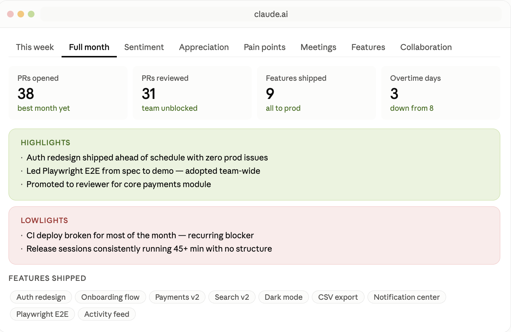
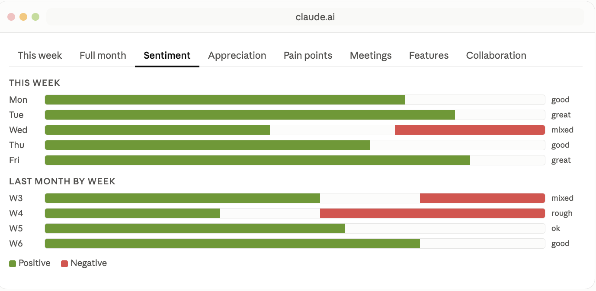
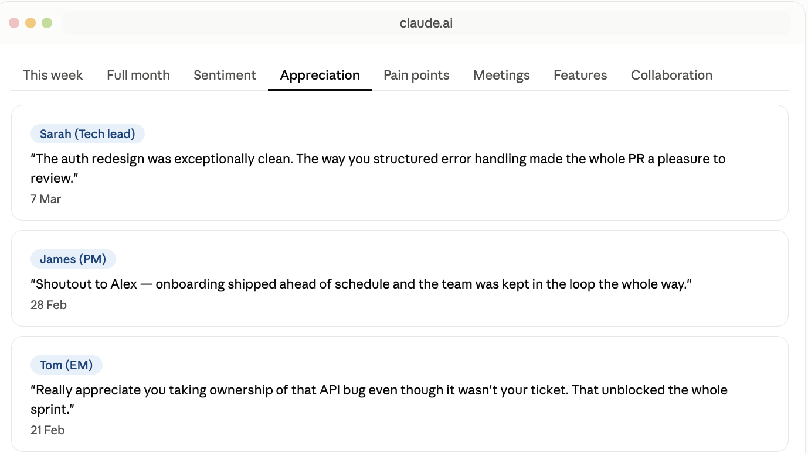
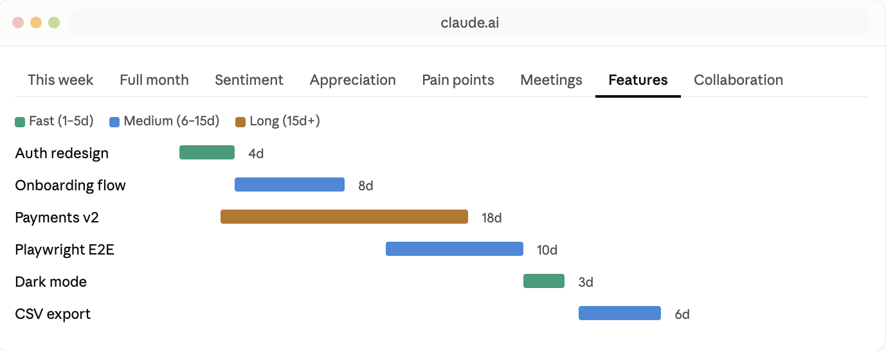
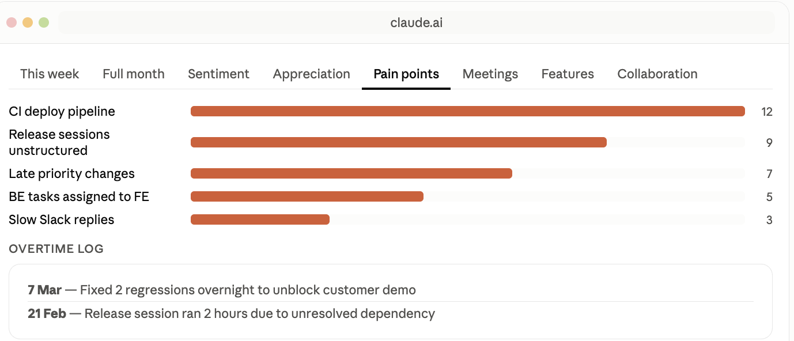

# MJ Skills

A collection of custom skills for Claude Code and other AI coding agents.

## Skills

### Journal Dashboard

An interactive work journal dashboard that reads your engineering journal and renders a 9-tab dashboard with weekly highlights, sentiment tracking, appreciation, pain points, meeting load, feature delivery timelines, collaboration maps, and skills picked up.

**Tabs:**

| Tab | What it shows |
|-----|---------------|
| This week | Highlights and challenges for current + previous week |
| Full month | Metric cards, shipped features, monthly summary |
| Sentiment | Daily mood bars with positive/negative breakdown |
| Appreciation | Positive feedback from teammates with quotes and dates |
| Pain points | Recurring friction themes ranked by frequency |
| Meeting load | Regular vs friction meetings per week |
| Feature delivery | Gantt-style timeline colored by delivery speed |
| Collaboration | Teammate cards with interaction scores and tags |
| Skills picked up | New tools, platforms, and techniques learned |

---

### Screenshots

#### Month Highlights


#### Sentiments


#### Appreciations


#### Features


#### Pain Points


## Install

```bash
npx skills add dashtaki/mj-skills
```

## Usage

Once installed, trigger the journal skill in Claude Code by saying:

- `/journal`
- "show my journal dashboard"
- "how was my week"
- "analyze my journal"

The skill reads your journal from Google Drive, a pasted text, or a local file.

## License

MIT
